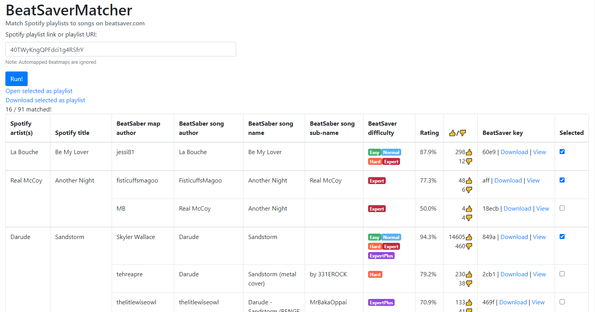

# BeatSaverMatcher
Web app to match Beat Saber beatmaps to Spotify/Tidal playlists.

Currently hosted at [beat-saver-matcher.uwu.industries](https://beat-saver-matcher.uwu.industries/)

## Features
- find all Beatsaver beatmaps for each song in a Spotify/Tidal playlist
- progress indicator
- manual selection of beatmaps
- direct link to BeatSaver to preview beatmap
- show the difficulties and ratings for each beatmap
- download multiple beatmaps as a `bplist` playlist

## Screenshot

## Installation

This isn't really supposed to be hosted by anyone themselves, but if you need to do that anyways, here's a rough sketch of what you'll have to do:

- create a Spotify App under https://developer.spotify.com/dashboard and copy the Client ID and Client Secret to the compose file
- create a Tidal App under https://developer.tidal.com/dashboard/ and copy the Client ID and Client Secret to the compose file
- start the app, redis and db using docker-compose (`docker-compose up -d`)
- connect to the database (for example, with Microsoft SQL Server Management Studio), create the database (called `BeatSaverMatcher`) and run the `schema.sql` script to create the required table(s)
- `docker-compose restart`
- check logs of the service if beatsaver.com scraping works correctly
- check if web app is running and working correctly (port 8080 by default)